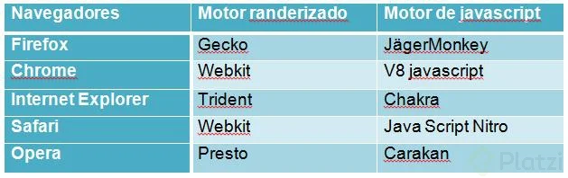

# Escuela de Javascript

## Curso de Frontend Developer

Instructora: **@teffcode**

[Archivos del curso](https://github.com/platzi/curso-frontend-developer)

[Manual del curso](./manual-para-imprimir.pdf)

[Roadmap](https://roadmap.sh/)

## HTML y CSS

[**Notion**: Curso Definitivo de HTML y CSS](https://www.notion.so/crobertizdev/Curso-Definitivo-de-HTML-y-CSS-e4c27acbeb614731a4bb78c042b5a7d2)

## Motores de renderización

Cada navegador tiene su propio motor de renderización y su labor es interpretar y traducir el código HTML y CSS a código que el navegador pueda entender y hacer visible en pixeles lo que nosotros hemos escrito. Este motor es diferente al motor de javascript.

Los motores realizan los siguientes 5 pasos (Critical Render Path)

- DOM: Pasar los archivos HTML a objetos (DOM)

- CSSDOM: Calcular los estilos que deben ir en los objetos del DOM.

- Render Tree: Calcular dimensión y posición de los objetos o nodos, estructurara la página.

- Layout: Pintar las diferentes cajas.

- Paint: Toma las diferentes capas y las convierte en un imagen para mostrar en la pantalla

[Explicación del Critical Render Path](https://medium.com/techwomenc/mejora-el-rendimiento-de-los-sitios-web-parte-1-optimiza-el-critical-render-path-7108896b590d)
