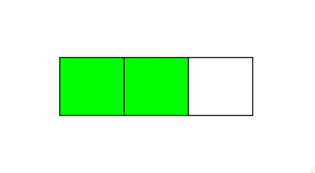
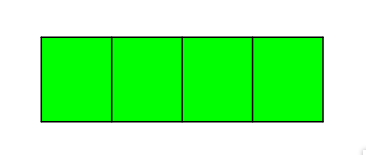

# Tabla de contenido

- [Fracciones](#fracciones)
  - [Tipos de fracciones](#tipos-de-fracciones)
  - [Fracciones equivalentes](#fracciones-equivalentes)

# Fracciones

$\huge {\frac{5}{12}}$ cinco doceavos

$\huge {\frac{3 \ \rightarrow \ numerador}{5 \ \rightarrow \ denominador}} $

El **numerador** es el número de partes que se seleccionan.

El **denominador** es el número de partes iguales en que se divide la unidad.

## Tipos de fracciones

[Representacion grafica de fracciones](https://www.geogebra.org/m/HWEGBuXF)

- **Fracción propia**: $\huge {\frac{2}{3}}$

  Se dibuja una unidad y va quedar deleccionado menos de una unidad. El numerador es menor al denominador.

  

- **Fracción unitaria** $\huge {\frac{4}{4}}$

  Se dibuja una unidad y queda seleccionada toda la unidad. Siempre es 1.

  

- **Fracción impropia** $\huge {\frac{5}{2}}$

  Se dibujan varias unidades. El numerador es mayor al denominador
