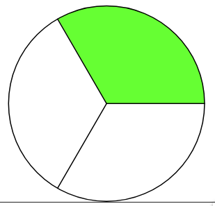
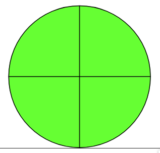

# Tabla de contenido

- [Fracciones](#fracciones)
  - [Tipos de fracciones](#tipos-de-fracciones)
  - [Fracciones equivalentes](#fracciones-equivalentes)
  - [Simplificar fracciones](#simplificar-fracciones)

# Fracciones

$\huge {\frac{5}{12}}$ cinco doceavos

$\huge {\frac{3 \ \rightarrow \ numerador}{5 \ \rightarrow \ denominador}} $

El **numerador** es el número de partes que se seleccionan.

El **denominador** es el número de partes iguales en que se divide la unidad.

## Tipos de fracciones

[Representacion grafica de fracciones](https://www.geogebra.org/m/HWEGBuXF)

- **Fracción propia**: $\huge {\frac{2}{3}}$

  Se dibuja una unidad y va quedar seleccionado menos de una unidad. El numerador es menor al denominador. En este caso cada fraccion de la unidad es 1 / 3.

  

- **Fracción unitaria** $\huge {\frac{4}{4}}$

  Se dibuja una unidad y queda seleccionada toda la unidad. Siempre es 1. En este caso cada fraccion de la unidad es 1 / 4.

  

- **Fracción impropia** $\huge {\frac{5}{2}}$

  Se dibujan varias unidades. El numerador es mayor al denominador. En este caso cada fraccion de la unidad es 1 / 2.

  

## Fracciones equivalentes

Deben ser unidades iguales.

$$\ Media hora = 2 \ cuartos de hora$$

$$\ {\frac{1}{2}}hora = {\frac{2}{4}} de hora $$

Son equivalentes cuando representan la misma parte de la unidad. Una forma de saber si ambas fracciones son equivalentes es simplificando. Es este ejemplo las tres fracciones son quivalentes.

$$\ {\frac{4}{8}} = {\frac{2}{4}} = {\frac{1}{2}}$$

Otra forma de saber si dos fracciones son equivalentes es multiplicando extremos y medios:

- Extremos: { 3 , 4 }

- Medios: { 2 , 6}

$${\frac{3}{2}} \ \ {\frac{6}{4}} = 12$$

Si la multiplicacion de los extremos da igual a a la multiplicacion de los medios entonces son equivalentes.

$${\frac{5}{6}} = {\frac{20}{24}}$$

Ambas fracciones no son equivalentes:

$${\frac{5}{6}}	\neq {\frac{20}{24}}$$

## Simplificar fracciones

Hallar la fraccion irreducible. Encontrar un fracción equivalente a otra pero escrita con un número mas pequeño. Reducir a su mínima expresion.

Dividir el numerador y denominador entre un mismo número primo (números primos { 2 , 3 , 5 , 7 , 11 ... }). Siempre se debe dividir por el mismo nro el numerador y el denominador.

1. $$\ {\frac{2}{4}} = {\frac{1}{2}} \rightarrow Esto \ es \ asi \ porque \ {{2}\div{2}} = 1 \ y \ {{4}\div{2}} = 2$$

> En ambas divisiones el resto debe ser 0, es decir el cociente no debe ser un nro decimal, sino es asi se intenta con el numero primo que le sigue.

2. $$\ {\frac{18}{30}} = {\frac{9}{15}} = {\frac{3}{5}}$$
   Intentamos primero dividiendo por 2
   $$18\div2 = 9$$
   $$30\div2 = 15$$
   Si dividimos 9 entre 2 nos da un decimal por lo que intentamos con el 3
   $$9\div3 = 3$$
   $$15\div3 = 5$$
