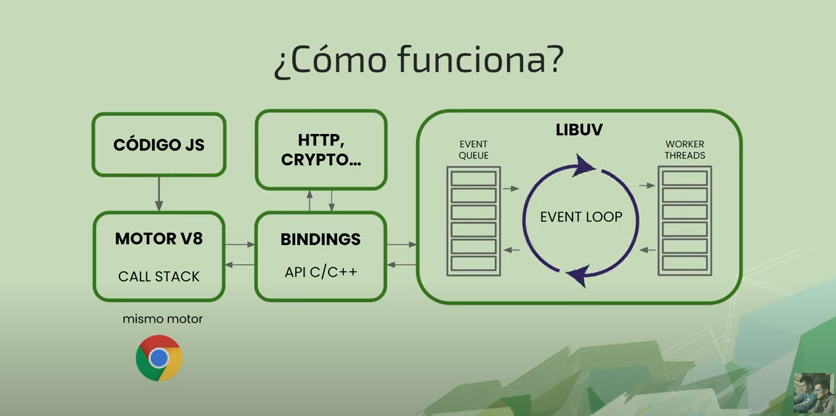

# Tabla de contenido

- [Nodejs](#nodejs)
- [Instalación](#instalación)
  - [Funciones de las versiones de node](#funcionamiento-de-las-versiones-de-node)
  - [Como funciona node](#como-funciona-node)

# Nodejs

Entorno de ejecución que nos permite ejecutar Javascript sin necesidad de un navegador web. Nodejs viene con npm, un gestor de paquetes para node.

- Interactuar con el sistema operativo(archivos,red).
- Ejecutar Javascript modo servidor.
- Backend web,cli apps ...

# Instalación

Hay 2 formas de instalarlo

1. A traves del gestor de paquetes de tu sistema operativo
   https://nodejs.org/es/download/package-manager/

2. Con [nvm](https://github.com/nvm-sh/nvm) (node version manager)

Comprobar la versión

```bash
node --v
npm --v
```

### Ejecutar node:

```bash
node console.log('Hello')
```

```bash
node main.js
```

## Funcionamiento de las versiones de node:

https://nodejs.org/es/about/releases/

Usar siempre la version _Active LTS_ ya que es la versión mas estable.

## Como funciona node:

https://dev.to/denispixi/que-es-node-js-y-como-funciona-46ck



# Módulos en JavaScript: explicación de CommonJS y ESmodules

https://www.freecodecamp.org/news/modules-in-javascript/#bundlingmodules
