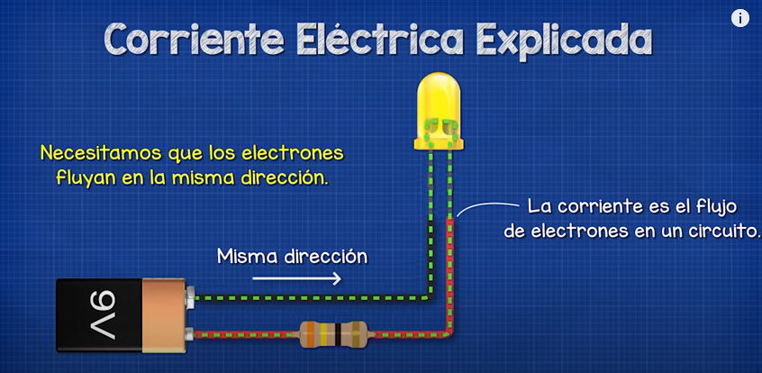
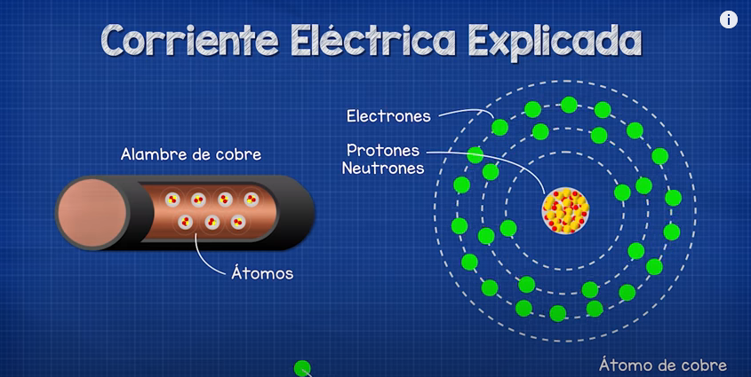
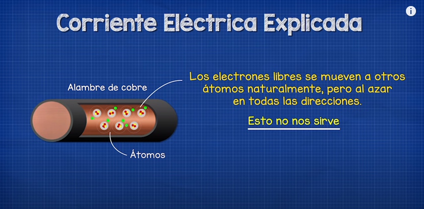
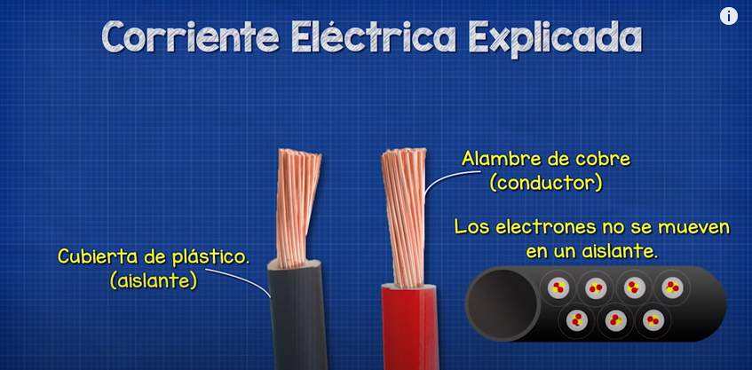
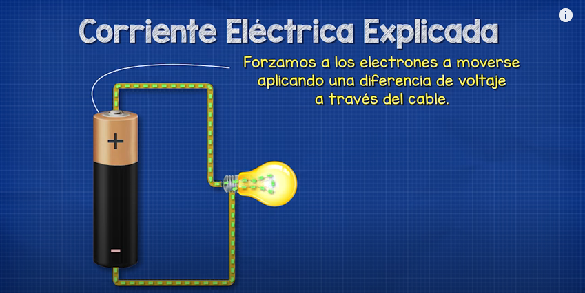

# Conceptos Básicos

**Libros**

- [Principios de circuitos eléctricos, Thomas L. Floyd, 8va Edición, Ed. Pearson](./Principios_de_circuitos_electricos.pdf)
- [ Circuitos eléctricos y electrónicos, Fundamentos y técnicas para su análisis, Jorge Raúl Villaseñor Gómez, Ed. Pearson.](./Circuitos%20el%C3%A9ctricos%20y%20electr%C3%B3nicos%20-%20Jorge%20Ra%C3%BAl%20Villase%C3%B1or%20G%C3%B3mez.pdf)

**Simbolos Eléctricos**

- [Página web](https://www.simbologia-electronica.com/simbologia-electrica-electronica/simbolos-electricos-electronicos-basicos.htm)

**Contenido**

- Electricidad
- Electrón
- [Corriente eléctrica](#corriente-eléctrica)
- [Carga eléctrica](#carga-eléctrica)
- [Magnetismo](#magnetismo)
- [Campo magnético](#campo-magnético)
- Campo Eléctrico
- Campo electromagnético
- [Circuito eléctrico](#circuito-eléctrico)
- [Corriente eléctrica](#circuito-eléctrico)
- Descarga eléctrica

## Magnetismo

## Corriente eléctrica (I)

[Wikipedia](https://es.wikipedia.org/wiki/Corriente_el%C3%A9ctrica)

**Dudas:**

1. ¿Porqué solo los electrones son movidos por el voltaje?
2. ¿Si todos los materiales tienen electrones porque todos no son conductores?
3. ¿Como funciona la corriente alterna?
4. ¿los electrones que fluyen de que material salen?¿De la batería?
5. ¿ Como se mide el voltaje?¿Mientras mas alto mas rapido se mueven los electrones?¿y eso en que afecta a la bombilla?

Flujo de [carga eléctrica](#carga-eléctrica)**?** que recorre un material.

Es el flujo de electrones en un [circuito eléctrico](#circuito-eléctrico)**?**.
Una corriente eléctrica, puesto que se trata de un movimiento de cargas, produce un [campo magnético](#campo-magnético), un fenómeno que puede aprovecharse en el [electroimán](https://es.wikipedia.org/wiki/Electroim%C3%A1n).

Normalmente utilizamos cable de cobre para formar el circuito porque el cobre un muy buen conductor eléctrico, lo que significa que los átomos que conforman el cobre tienen un electrón debilmente ligado en esa capa exterior o de valencia que es libre de moverse dentro del metal.

Este electrón libre se mueve muy facilmente, por eso el cobre es tan utilizado. Es tan facil de mover que se moverá naturalmente a otros átomos de cobre por si mismo. Pero esto ocurre al azar en todas las direcciones lo que no nos sirve.

Envolvemos el cobre en plastico porque el plastico es un aislante, lo que significa que no permite que los electrones libres pasen a traves de el. Eso proporciona una barrera y mantiene la electricidad dentro de los cables y lejos de nosotros.

Para usar la electricidad necesitamos que los electrones fluyan en la misma dirección alrrededor de un circuito. Podemos entonces colocar cosas como lámparas en el camino de estos electrones para que tengan que fluir a traves de el y genera luz y calor en el proceso. Para hacer esto necesitamos forzar a los electrones a moverse y podemos hacerlo aplicando un voltaje

**Notas:**

Los átomos del cobre tiene un monton de electrones pero los que fluyen en un circuito electrico son solo los electrones de valencia, es decir los electrones que se encuentran libres en la ultima orbita del atomo. Todos los electrones de valencia juntos forman un mar de electrones libres y fluyendo a traves del voltaje forman la llamada corriente electrica.

La bateria proporciona voltaje que impulsa a los electrones a moverse en una dirección.

## Campo Magnético

Los iman
